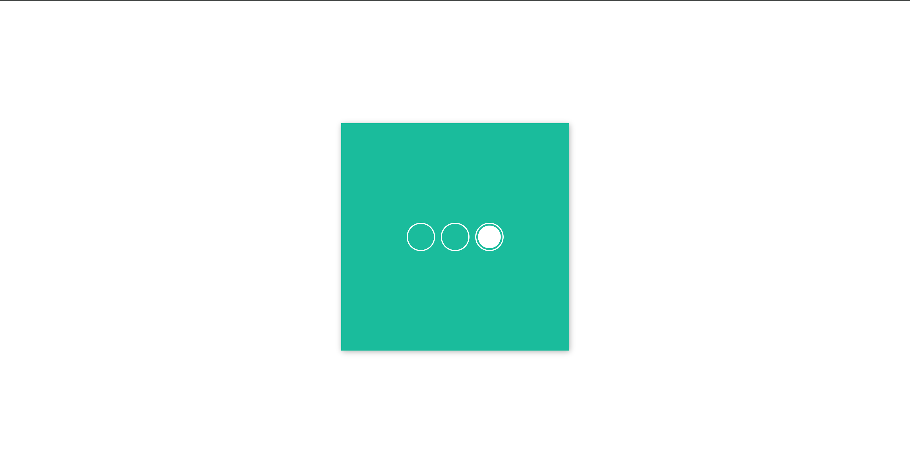

<h1>Slider with Radio Buttons</h1>

<h2>Challenge Description</h2>

Why use JavaScript when you can use CSS? This challenge demonstrates how to create an interactive slider using only CSS selectors, showcasing the versatility and power of CSS.

<h2>Introduction</h2>

This challenge is part of the 100 Days CSS Challenge. The goal is to create a functional and interactive slider using only CSS, without any JavaScript. This exercise highlights the capabilities of CSS selectors and animations.

<h2>Purpose</h2>

The purpose of this challenge is to demonstrate how CSS alone can be used to create dynamic and interactive web components. By completing this challenge, you will improve your understanding of CSS selectors and animations.

<h2>Features</h2>

<ul>
  <li>Interactive slider</li>
  <li>Pure CSS implementation</li>
  <li>No JavaScript required</li>
  <li>Responsive design</li>
</ul>

<h2>Prerequisites</h2>

You will need a web browser to view the project. No additional installations are required.

<h2>File Structure</h2>

<pre>
Slider-with-Radio-Buttons/
├── index.html
├── style.css
└── README.md
</pre>

<h2>Tools</h2>

<ul>
  <li>Visual Studio Code (VS Code)</li>
  <li>Any Web Browser</li>
</ul>

<h2>Preview</h2>

Check out the live demo <a href="https://codepen.io/Yashi-the-lessful/pen/jOoowGy">here</a>.

<h3>Usage</h3>

<ul>
  <li>Use the radio buttons to navigate through the slider.</li>
  <li>Customize the slider by editing the CSS in the <code>style.css</code> file.</li>
</ul>

<h2>Contributing</h2>

Contributions are welcome! Here's how you can contribute:

<ol>
  <li>Fork the repository.</li>
  <li>Create a new branch: <code>git checkout -b feature/my-feature</code>.</li>
  <li>Make your changes.</li>
  <li>Commit your changes: <code>git commit -am 'Add my feature'</code>.</li>
  <li>Push to the branch: <code>git push origin feature/my-feature</code>.</li>
  <li>Submit a pull request.</li>
</ol>

<h2>Credits</h2>

This challenge was inspired by the <a href="https://100dayscss.com/days/19/">100 Days CSS Challenge</a>.

<h2>Author</h2>

<a href="https://github.com/Yashi-Singh-1">Yashi Singh</a>

